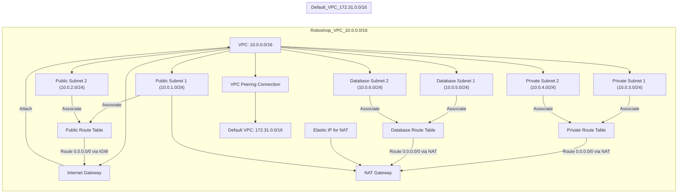

📄 Suggested README.md content:
markdown
Copy
Edit
# 🚀 Terraform AWS VPC Module

This repository contains a **production-grade reusable Terraform module** for provisioning a VPC in AWS, including:
 - ✅ Public, Private, and Database Subnets (across AZs)
- ✅ Internet Gateway, NAT Gateway, and Route Tables
- ✅ Elastic IP for NAT, CIDR input support
- ✅ Clean input variables and output structure
- ✅ VPC Peering support for connecting multiple VPCs

---

## 🌱 Why I Built This

As part of my AWS and Terraform journey, I wanted to **understand networking deeply** and go beyond tutorials. This module was built **from scratch**, after several mistakes, fixes, validations, and real test deployments.

### 🎓 Key Learnings

- Difference between **AZ vs Region**, and how to use `data.aws_availability_zones`
- Correct subnet CIDR planning and AZ mapping
- Properly tagging resources using `merge()` and `locals`
- Use of `map_public_ip_on_launch` only in **public subnets**
- Role of **Elastic IPs** vs ephemeral IPs for NAT Gateways
- Breaking changes and how `terraform state` helps you recover
- How to configure **VPC Peering** for secure cross-VPC communication


---


## 🧠 What This Module Provisions

| Resource      | Description                        |
|---------------|------------------------------------|
| VPC           | With provided CIDR block           |
| Subnets       | Public, Private, Database (in AZs) |
| Route Tables  | One each for public, private, DB   |
| IGW / NAT GW  | Based on need                      |
| Elastic IP    | Static IP for NAT gateway          |
| Outputs       | All subnet IDs, gateway IDs, AZ info|
|VPC Peering	  | Secure connection to another VPC|

---

## 🧰 Tools Used

- Terraform v1.8.x
- AWS Free Tier
- VS Code + Terraform Extension
- Git + GitHub for versioning

---

## 💡 Why This Stands Out

- ✅ Production-level modularity
- ✅ Explained visually in [vpc-module-test](https://github.com/MAHALAKSHMImahalakshmi/vpc-module-test)
- ✅ Shows beginner mistakes and how I debugged/fixed them
- ✅ Excellent for interviews and internal use in companies

---

## 👨‍💻 Author

**[Mahalakshmi R](https://github.com/MAHALAKSHMImahalakshmi/)**  
💡 Passionate about DevOps, Infra, and Cloud

---
```markdown
# Terraform AWS VPC Module Setup

This README provides a detailed explanation of the Terraform AWS VPC module setup for creating a robust VPC environment with public, private, and database subnets, including VPC peering with the default VPC.

---

## 1. VPC Creation
- Creates a Virtual Private Cloud (VPC) with a specified CIDR block (e.g., `10.0.0.0/16` for Roboshop).
- Enables DNS hostnames for instances within the VPC.
- Applies tagging for project and environment identification to manage resources effectively.

## 2. Internet Gateway (IGW)
- Creates an Internet Gateway (IGW) automatically attached to the created VPC.
- IGW is tagged for easy identification.
- Provides internet access for resources in public subnets.

## 3. Subnets Creation
- Creates 2 Public Subnets distributed across different Availability Zones (AZs).
  - `map_public_ip_on_launch = true` to assign public IPs automatically to instances launched in these subnets.
- Creates 2 Private Subnets distributed across AZs.
- Creates 2 Database Subnets distributed across AZs.
- All subnets include tags indicating project, environment, subnet type, and AZ for proper organization.

## 4. Elastic IP and NAT Gateway
- Allocates an Elastic IP (EIP) to ensure a static public IP for the NAT Gateway.
- Creates a NAT Gateway in one of the public subnets using the allocated EIP.
- NAT Gateway creation is dependent on the IGW to ensure correct resource provisioning sequence.
- NAT Gateway allows instances in private and database subnets to access the internet without exposing them publicly.

## 5. Route Tables and Routing
- Creates three route tables named **Public**, **Private**, and **Database**.
- Public Route Table:
  - Routes all Internet traffic (`0.0.0.0/0`) via the IGW.
  - Associated with the two public subnets.
- Private Route Table:
  - Routes all Internet traffic via the NAT Gateway.
  - Associated with the two private subnets.
- Database Route Table:
  - Routes all Internet traffic via the NAT Gateway.
  - Associated with the two database subnets.

## 6. Route Table Associations
- Associates the Public Route Table with public subnets.
- Associates the Private Route Table with private subnets.
- Associates the Database Route Table with database subnets.

## 7. VPC Peering
- Establishes a peering connection with the default VPC (CIDR `172.31.0.0/16`).
- Updates route tables to enable seamless communication between the two VPCs:
  - In the Roboshop VPC's Public, Private, and Database route tables, adds a route with destination `172.31.0.0/16` targeting the peering connection.
  - In the Default VPC’s main route table, adds a route with destination `10.0.0.0/16` targeting the peering connection.

---

## Example Module Inputs

```
module "vpc" {
  source               = "../terraform-aws-vpc"
  project              = var.project
  environment          = var.environment
  cidr_block           = "10.0.0.0/16"
  public_subnet_cidrs  = ["10.0.1.0/24", "10.0.2.0/24"]
  private_subnet_cidrs = ["10.0.3.0/24", "10.0.4.0/24"]
  database_subnet_cidrs = ["10.0.5.0/24", "10.0.6.0/24"]
  is_peering_required  = true
  peer_vpc_cidr        = "172.31.0.0/16"  # CIDR of the Default VPC
  peer_vpc_id          = "vpc-xxxxxxxx"   # VPC ID of the Default VPC
}
```

---

## Connections and Dependencies

| Resource              | Depends On                 | Description                                      |
|-----------------------|----------------------------|--------------------------------------------------|
| VPC                   | None                       | The main network container                        |
| Internet Gateway (IGW) | VPC                        | Provides Internet access for public subnets      |
| Public Subnets        | VPC, Availability Zones     | Public-facing subnetworks with direct internet   |
| Private Subnets       | VPC, Availability Zones     | Internal subnets without direct Internet access  |
| Database Subnets      | VPC, Availability Zones     | Secure subnets for sensitive database workloads  |
| Elastic IP for NAT    | None                       | Static public IP address for NAT Gateway          |
| NAT Gateway          | Elastic IP, Public Subnet, IGW | Provides internet access for private and db subnets |
| Route Tables (Public, Private, Database) | VPC            | Containers for routing rules                       |
| Routes                | IGW for public routes, NAT Gateway for private/db routes | Define traffic direction                           |
| Route Table Associations | Subnets, Route Tables    | Associates route tables to respective subnets     |
| VPC Peering Connection | Two VPCs                   | Securely connects multiple VPCs                    |
| Route Updates for Peering | VPC Peering Connection   | Enables routing between peered VPCs                |

---

This setup provides a scalable and secure AWS network architecture using Terraform, supporting multi-subnet segmentation and VPC peering for cross-VPC communication.

For any questions or help with Terraform code examples for peering routes or security configurations, feel free to ask.
```

  
## This visualization and explanation cover everything you mentioned:

- Creation of VPC, IGW, NAT Gateway with EIP.

- Public, private, and database subnets with correct route table associations.

- Route tables with routes via IGW and NAT Gateway.

- VPC peering connection with routes between the roboshop VPC and default VPC for cross-VPC communication.
 
