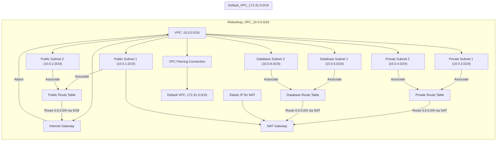

📄 Suggested README.md content:
markdown
Copy
Edit
# 🚀 Terraform AWS VPC Module

This repository contains a **production-grade reusable Terraform module** for provisioning a VPC in AWS, including:
 - ✅ Public, Private, and Database Subnets (across AZs)
- ✅ Internet Gateway, NAT Gateway, and Route Tables
- ✅ Elastic IP for NAT, CIDR input support
- ✅ Clean input variables and output structure
- ✅ VPC Peering support for connecting multiple VPCs

---

## 🌱 Why I Built This

As part of my AWS and Terraform journey, I wanted to **understand networking deeply** and go beyond tutorials. This module was built **from scratch**, after several mistakes, fixes, validations, and real test deployments.

### 🎓 Key Learnings

- Difference between **AZ vs Region**, and how to use `data.aws_availability_zones`
- Correct subnet CIDR planning and AZ mapping
- Properly tagging resources using `merge()` and `locals`
- Use of `map_public_ip_on_launch` only in **public subnets**
- Role of **Elastic IPs** vs ephemeral IPs for NAT Gateways
- Breaking changes and how `terraform state` helps you recover
- How to configure **VPC Peering** for secure cross-VPC communication

---

## 🧠 What This Module Provisions

| Resource      | Description                        |
|---------------|------------------------------------|
| VPC           | With provided CIDR block           |
| Subnets       | Public, Private, Database (in AZs) |
| Route Tables  | One each for public, private, DB   |
| IGW / NAT GW  | Based on need                      |
| Elastic IP    | Static IP for NAT gateway          |
| Outputs       | All subnet IDs, gateway IDs, AZ info|
|VPC Peering	  | Secure connection to another VPC|

---

## 🧰 Tools Used

- Terraform v1.8.x
- AWS Free Tier
- VS Code + Terraform Extension
- Git + GitHub for versioning

---

## 💡 Why This Stands Out

- ✅ Production-level modularity
- ✅ Explained visually in [vpc-module-test](https://github.com/MAHALAKSHMImahalakshmi/vpc-module-test)
- ✅ Shows beginner mistakes and how I debugged/fixed them
- ✅ Excellent for interviews and internal use in companies

---

## 👨‍💻 Author

**[Mahalakshmi R](https://github.com/MAHALAKSHMImahalakshmi/)**  
💡 Passionate about DevOps, Infra, and Cloud

---

  

 
